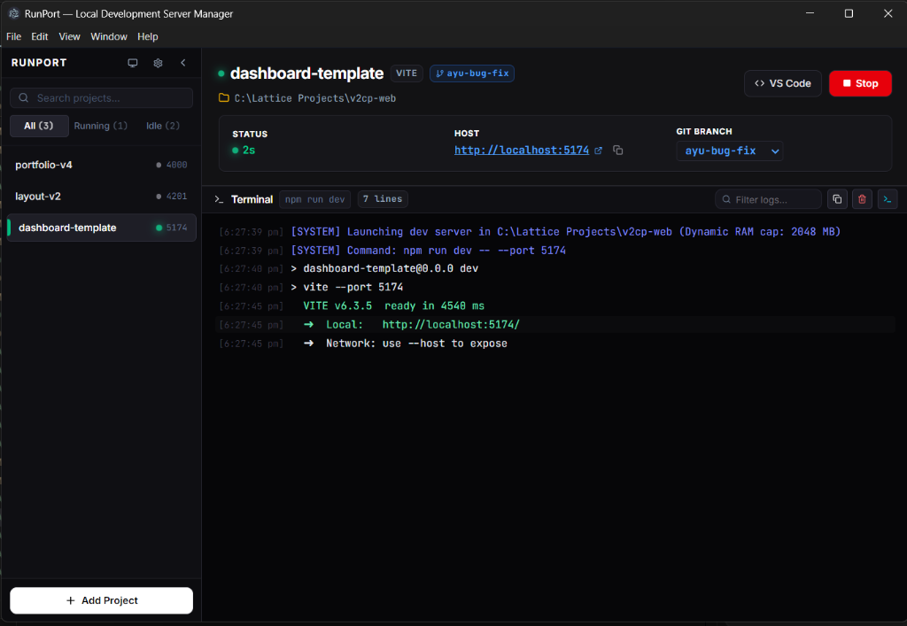

<div align="center">


# RunPort

**Stop juggling terminals. Control all your dev servers from one place.**

[](https://github.com/Ayush-Antiwal/RunPort/releases/latest)
[](LICENSE)
[](https://github.com/Ayush-Antiwal/RunPort/stargazers)

[**🌐 Website**](https://ayush-antiwal.github.io/RunPort) · [**📥 Download**](https://github.com/Ayush-Antiwal/RunPort/releases/latest) · [**🐛 Report a Bug**](https://github.com/Ayush-Antiwal/RunPort/issues/new?template=bug_report.md) · [**💡 Request a Feature**](https://github.com/Ayush-Antiwal/RunPort/issues/new?template=feature_request.md)

</div>

---

## What is RunPort?

RunPort is a Windows desktop app that gives you a single dashboard to manage all your local development servers.

Instead of opening a new terminal for every project, navigating to the right folder, and remembering which `npm run dev` variant to use — you register your projects once and control them all from one place.

Start, stop, restart, and open any project in the browser with a single click.

---

## Who is it for?

- **Freelancers** juggling multiple client projects simultaneously
- **Full-stack developers** running a frontend, backend, and worker services at once
- **Team leads** who onboard developers and want a zero-confusion local setup

---

## Key Features

| Feature　　　　　　　　　　　| Description                                                                                 |
| ------------------------------| ---------------------------------------------------------------------------------------------|
| ⚡ **Auto-Detection**　　　　 | Identifies your project's framework and package manager automatically when you add a folder |
| 🖥️ **Floating Widget**　　　 | A mini always-on-top window for 1-click start/stop without switching away from your code    |
| 🛠️ **Port Conflict Resolver** | Detects occupied ports and offers to kill the occupying process or pick the next free port  |
| 📋 **Live Log Streaming**　　| See real-time server output — startup messages, errors, URLs — right inside the app         |
| 📊 **Git Branch & Uptime**　 | Shows your active Git branch and how long each server has been running                      |
| 🔔 **System Tray**　　　　　 | Minimize RunPort to the tray. Start All / Stop All from the tray context menu               |

---

## Supported Frameworks & Runtimes

Next.js · Vite · Create React App · Angular · Nuxt · Vue CLI · NestJS · Express · Python · Go · Cargo (Rust)

Package managers: `npm` · `pnpm` · `yarn` · `bun`

---

## Screenshots



---

## Download

**[⬇️ Download the latest Windows installer](https://github.com/Ayush-Antiwal/RunPort/releases/latest)**

RunPort is currently available for **Windows**. macOS and Linux support is planned.

---

## Roadmap

- [ ] Development Profiles (group projects, start/stop as a set)
- [ ] Docker service management
- [ ] WSL environment support
- [ ] macOS support
- [ ] Resource monitoring (CPU/RAM per process)
- [ ] Auto-restart on crash

---

## Tech Stack

Built with Electron · React 19 · TypeScript · Vite · TailwindCSS · Radix UI

---

## Installation & Development

### Prerequisites
- [Node.js](https://nodejs.org/) v18 or higher
- npm / pnpm / yarn

### Setup

```bash
# Clone the repository
git clone https://github.com/Ayush-Antiwal/RunPort.git
cd RunPort

# Install dependencies
npm install

# Run in development mode (hot reload)
npm run dev

# Build a production Windows installer
npm run dist
# Output: release/RunPort Setup x.x.x.exe
```

---

## Contributing

Contributions are welcome! See [CONTRIBUTING.md](CONTRIBUTING.md) for setup instructions, code style guidelines, and the PR process.

Please read our [Code of Conduct](CODE_OF_CONDUCT.md) before participating.

## Author

Created and maintained by [**Ayush Antiwal**](https://ayushantiwal.in) ([@Ayush-Antiwal](https://github.com/Ayush-Antiwal)).

---

## License

RunPort is open-source software licensed under the [MIT License](LICENSE). Free for personal, commercial, academic, and open-source use.

